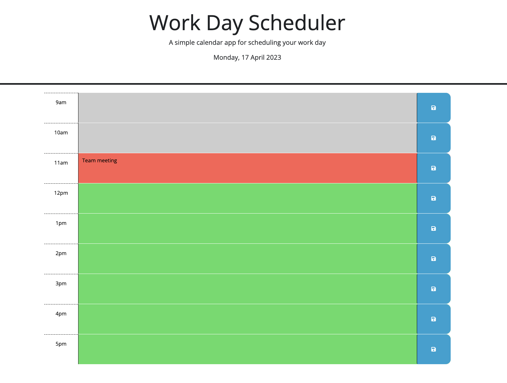

# Work Day Scheduler

A simple calendar app for scheduling the work day activities

## Deployment Link

## Technologies used for this project

- JavaScript
- CSS
- HTML

## Description

Using a daily planner to create a schedule, when user opens the planner, the current day is displayed at the top of the calendar. When user scrolls down, timeblocks for standard business hours are shown. When timeblocks for that day are viewed, each timeblock is color coded to indicate whether it is in the past, present, or future. When timeblock is clicked, event can be entered. When user clicks the save button for that timeblock, the text for that event is saved in local storage. Once the page is refreshed, the saved events are still shown to the user.

